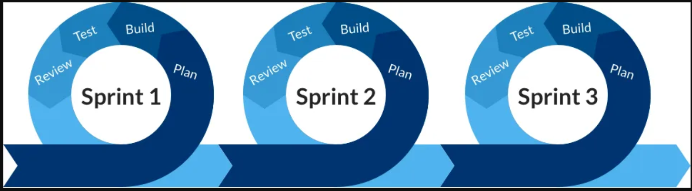
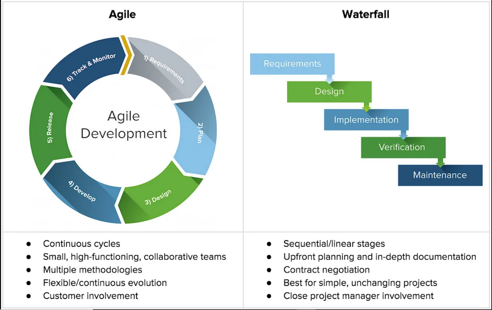
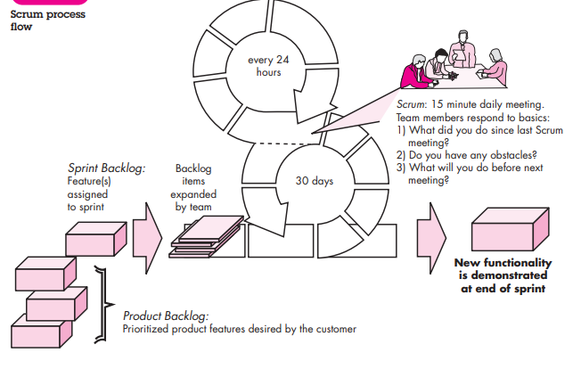
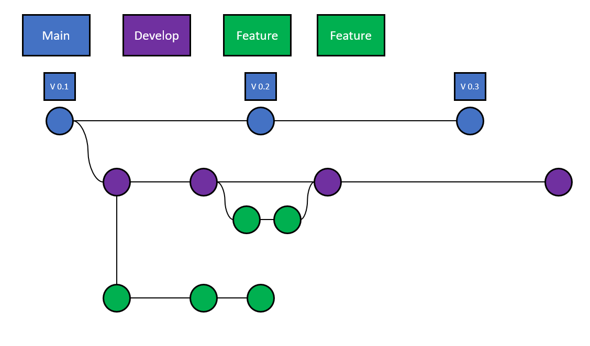

# Lecture plan

1. SDLC
2. GIT

---

# Software

- What is software?
## Characteristics of Software

1. Software is developed or engineered. It is not manufactured.
2. Software doesn’t “wear out”. It "deteriorates!"
3. Although the industry is moving toward component-based construction, most
software continues to be custom built.

# Software application domains

1. System software
2. Application software
3. Engineering/scientific software
4. Embedded software
5. Product-line software
6. Web application
7. Artificial intelligence software
8. Legacy Software

# Software engineering

- What is software engineering?

To build software that meets all the challenges of the 21st century, few realities sould be considered:

- A concerted effort should be made to understand the problem before a software solution is developed.
- Design becomes a pivotal activity.
- Software should exhibit high quality.
- software should be maintainable

<b>Conclusion:</b> Software in all of its forms and across all
of its application domains should be engineered.

<b>Software Engineering:</b>  The application of a systematic, disciplined, quantifiable approach
to the development, operation, and maintenance of software; that is, the application of
engineering to software.

Questions:

- Why does it take so long to get software finished?
- Why are development costs so high?
- Why can’t we find all errors before we give the software to our customers?
- Why do we spend so much time and effort maintaining existing
programs?
- Why do we continue to have difficulty in measuring progress as software is
being developed and maintained?

<i>"It can be done fast, it can be done right, it can be done cheap. you can choose only two"</i>

# SDLC

Software development lifecycle describes the phases of software developmnet and the order in which the phases are executed.

1.  Requirement gathering and Analysis
2. Planning
4. Design
5. Implementation
6. Testing
7. Deployment
8. Maintainance

# Waterfall Model

Waterfall model is a linear or sequential model for project management. It works on fixed dates, requiremnts and outcomes.


A typical Waterfall project is chronological and is made up of the following phases:

1. Requirements

Written requirements for all stages is put into a single document and used for verification of each stage. The document is composed of constraints and functional and non-functional needs of the project, cost, assumptions, risks, dependencies, success metrics, and timelines for completion.

2. Design

A high-level design (HLD) is created to describe the purpose, the scope of the project, the general traffic flow of each component, and the integration points (the topology). A deatiled design is created, which allows subject matter experts (SMEs) to implement the HLD design to precise details.

1. Implementation

Implementation teams work to the design to create, code, implement, and test the solution. 

4. Verification

Acceptance tests are deployed to verify that project satisfies all the initial requiremnts. If it does not, a review is done to determine any ratification actions.


5. Maintenance

After deployment if the defects are raised or new versions of products are needed they are handeled in maitainance phase.


In the Waterfall Model, each stage can only continue when each of the previous stages are completed and signed off.


**Benifits:**

- cost and timeline can be determined in the begining as the project scope is static.
- The cost to fix or alter designs is minimun.
- SME's can effecticely plan their time this leads to a structured approach, that ensures that everyone understands what needs to be done and when.
- Less meetings and independent work enviorment.
- Detailed documentation and design will create some flexibility to add or remove existing key members in the team.

**Drawbacks:**

- New changes are hard to incorporate.
- Relatively slow pace and not suitable for rapid releases.
- HArd to estimate the exact time as any new change will lead to repetition of process.

# Agile

Agile methodology Agile methodology promotes iterative development with incremental releases.  It is iterative because it plans for the work of one iteration to be improved upon in subsequent iterations. It is incremental because completed work is delivered throughout the project.



The values and principles of the ‘Manifesto for Agile Software Development’ are:

**Values**
- Individuals and interactions over processes and tools
- Working software over comprehensive documentation
- Customer collaboration over contract negotiation
- Responding to change over following a  plan


**Principles**

- Customer satisfaction through early and continuous software delivery
- Accommodate changing requirements throughout the development process
- Frequent delivery of working software
- Collaboration between the business stakeholders and developers throughout the project
- Support, trust, and motivate the people involved
- Enable face-to-face interactions
- Working software is the primary measure of progress
- Agile processes to support a consistent development pace
- Attention to technical detail and design enhances agility
- Simplicity
- Self-organizing teams encourage great architectures, requirements, and designs
- Regular reflections on how to become more effective




The work and requirents are classified as:

Let's define each of these terms in the context of software development:

1. **Feature:** A feature refers to a distinct piece of functionality or behavior in a software product that provides value to its users or customers. It represents a specific capability that the software offers.

2. **Enhancement:** An enhancement refers to an improvement or addition to an existing feature or functionality in a software product. It aims to enhance the user experience, performance, or functionality of the system beyond its current state.

3. **Bug:** A bug, also known as a defect or issue, refers to an error, flaw, or unintended behavior in a software product. Bugs can cause the software to behave incorrectly, produce unexpected results, or crash. Bug fixing involves identifying, investigating, and resolving these issues to ensure the software functions as intended.

4. **Epic:** An epic represents a large body of work that cannot be completed within a single iteration or sprint. It represents a significant feature or functionality that provides business value. Epics are usually too big to estimate in terms of time or effort accurately. They are often broken down into smaller, manageable user stories or tasks.

5. **User Story:** A user story is a concise, written description of a feature or functionality from the perspective of a user or customer. It captures the "who," "what," and "why" of a requirement in a simple format. User stories are smaller than epics and can be estimated and completed within a single iteration. They serve as a means of communication and collaboration between stakeholders and the development team. The user stories are formated as As a "role"(who), I want to "Action"(what) so that benifit(why).

6. Task: A task represents the smallest unit of work required to complete a user story or an epic. It breaks down the work into specific actions or steps that need to be taken to implement a user story. Tasks are even more granular than user stories and can be estimated and completed within a short timeframe, typically a few hours to a day.

In summary, a feature represents a distinct functionality, an enhancement improves an existing feature, a bug refers to an error or flaw, an epic represents a large feature or functionality, a user story captures a requirement from a user's perspective, and a task represents a small unit of work required to complete a user story or an epic. These terms are commonly used in agile software development to plan, prioritize, and implement software projects.

Most commonly used agile methodolgies are:

### 1. Scrum Methodology



Scrum is an agile software development  method with principiles that are consistent with agile manifesto. The process contains the framwork activities: requiremnt, analysis, design, evolution and delivery. Within each framework activity a process pattern is implemented it is called as sprint.

- Work in sprint will vary depending on the problem in hand and cna ve modified in real time by the scrum team.

**Product Backlog:** The Product Backlog is a prioritized list of all the desired features, enhancements, and bug fixes for the software product. It represents the overall scope of work that needs to be completed. The Product Owner is responsible for maintaining and prioritizing the backlog based on business value and stakeholder input.

**Sprint Backlog:** The selected items from the Product Backlog are moved to the Sprint Backlog. The Sprint Backlog is a subset of the Product Backlog and contains the user stories or tasks that the development team commits to completing during the sprint. The team decomposes user stories into smaller tasks and estimates the effort required for each task.

**Scrum team roles:**

1. Product owner: Product expert who represents the stakeholders, and is the voice of the customer.
2. Development team: Group of professionals who deliver the product (developers, programmers, designers).
3. Scrum master: Organized servant-leader who ensures the understanding and execution of Scrum is followed.

**Scrum events:**

1. **Sprint:** Iterative time boxes where a goal is accomplished. Time frame does not exceed one calendar month and are consistent throughout the development process.
2. **Sprint planning:** The entire Scrum team get together at the beginning of every Sprint to plan the upcoming sprint.
3. **Daily Scrum:** Usually a 15 minute meeting held at the same time, every day of the Sprint, where the following questions are answred:

- What did you do since last Scrum meeting?
- Do you have any Obstacles?
- What will you do before next meeting?

4. **Sprint Execution:** The development team works on the tasks assigned to them in the Sprint Backlog. They collaborate, code, test, and integrate the features incrementally. The team has the autonomy to decide how to complete the work, but they collaborate closely to ensure a cohesive and integrated product.
   
5. **Sprint review:** An informal meeting held at the end of every Sprint where the Scrum team present their Increment to the stakeholders, and discuss feedback.
6. **Sprint retrospective:** A meeting where the Scrum team reflect on the proceedings of the previous Sprint and establish improvements for the next Sprint.


#### Story ponting

Story pointing is a technique used in agile development to estimate the relative effort or complexity of user stories. It helps the development team understand the effort required to implement a user story compared to others. The most common scale used for story pointing is the Fibonacci sequence (e.g., 1, 2, 3, 5, 8, 13). Each number represents a story point, which is an arbitrary unit of effort. The team collectively assigns story points to each user story based on complexity, technical challenges, and other factors.

It's important to note that story points and effort estimation are not precise measurements but rather a tool for the team to facilitate discussions and make informed decisions during the development process.


**Reference:**

1. <i>Software Engineering: A Practitioner's Approach</i>


---


# Git
#### Versioning

Consider that you are working on an essay for school. Initially, you will create a draft and save it in your system, now after completing the initial draft you made some changes like adding new information, deleting irrelevant information and correcting grammatical errors in the file. After making all these changes you will save the document using save as and save it as draft 2. You might be thinking why should I replace the draft one with the updated draft?

The reason might be that the verbose in the initial draft might be better or the information that you deleted might be important. So it's better to save the file as draft two.  Now consider it is a folder with multiple files, It becomes complex to store multiple drafts of all the files in the folder, Now consider that it's a group assignment and multiple people are working on the same files. Now it becomes even more complex.  After a while, it becomes hard to figure out which file contains what information and what changes were made.

Now let's correlate this example for software development. Similar to draft one and draft two, for every application launched, we have semantic versioning. A public API should be declared and the changes can be communicated to the API by incrementing the version number.  Semantic versioning contains three major indicators called Major, Minor and patch, represented as `Major.Minor.Patch`.  This number doesn't represent the size of the software or application.

Let's consider an initial release of a drone 1.0.0

It has some basic functionalities:


```
Move Up/Down (Throttle)
Tilt Forward/Backward (Pitch)
Move Left/Right ( Roll)
```


Everything looks fine but A Dorne itself is not worth more than a toy, to add some additional functionality a camera is added to the drone. 

Now the version is 1.1.0

```
Move Up/Down (Throttle)
Tilt Forward/Backward (Pitch)
Move Left/Right ( Roll)
Camera
```

This addition of the camera is a minor update because even without the camera the drone works but it's preferred to have a camera attached to the drone. Based on this example it can be concluded that the minor update brings a new feature which changes the API but is backwards compatible. To simply define, the minor update is a non-breakable change.

To improve the visibility and ease of image capturing a new movement should be added to rotate the drone left or right called Yaw. this upgradation is called a patch. Patch updates are interchangeable and consumers should update their software without hesitation. 


Now the version is 1.1.1

```
Move Up/Down (Throttle)
Tilt Forward/Backward (Pitch)
Move Left/Right ( Roll)
Camera
Rotate  Left/Right ( Yaw )
```

Now consider that The purpose of the drone is changed and now the drone is used to spray pesticides instead of image capturing.

With new update the version is 2.0.0


```
Move Up/Down (Throttle)
Tilt Forward/Backward (Pitch)
Move Left/Right ( Roll)
Rotate  Left/Right ( Yaw )
Camera
Storage tank and spray equipment.
```

The above update will change the software. The camera is removed and a new updated storage tank and spray equipment is added.
The major update will cause interface change and breaks the backward compatibility.


The above versioning applies to software development. As the number of updates grows, it becomes hard to classify and manage all the versions. On top of that the real-life development process includes collaboration. When multiple people work on the same project consisting of multiple files, it will lead to the following issues will arise:

1. Storage: All the files created for all changes will take up more storage.
2. Tracking: multiple changes made by multiple collaborators should be tracked.
3. Maintenance: The changes if not tested properly may break the application and if that happens the application must revert to its recent stable version.
4. Security: Not everyone should be allowed to make changes to the application.

To solve all the above problems and to add some additional functionalities version control system is used.

for additional information refer to [semver](https://semver.org/)

## Version Control System

Version control systems are classified into two types.

1. Centralized
2. Distributed

Consider a scenario where one of your friends has a board game and to play that game, all the friends can access it from that specific friend. This is an example of centralized VCS and now consider that a group of friends are playing an online game. Instead of gathering at a single place all the friends can connect and play from their homes. This is an example of distributed VCS.

To put it in technical terms, centralized VSC has a single central copy of the project and programmers will access and commit their changes from that copy. This arrangement is not preferred because if the central server fails, the entire project fails. A few examples of centralized VCS are  CVS Preforce and subversion.


In distributed VCS the codebase maintained in the server is copied to every individual developer's system. Even though a single user loses the data or a failure occurs in a single system, the code is preserved. A few examples of distributed VCS are GIT and Mercurial.


for additional information refer to [git version contol](https://git-scm.com/book/en/v2/Getting-Started-About-Version-Control)

## Git

As explained GIT is a free and open-source distributed version control system. It is used to handle small to large projects with speed and efficiency.

To install GIT refer to [git download](https://git-scm.com/downloads).

Once the installation procedure is completed, to check if GIT is installed in your system run the following command in the command prompt(windows) or terminal in case of mac os or Linux.

```
 git --version
```

If git is installed, the output should be the git version installed in your system.

GIT can be accessed using the command line, IDE and GUI.  In this document, we will use the command line tool GIT bash and VisualStudioCode IDE (VS code)

To download VS code refer to [VS Code Download](https://code.visualstudio.com/download)

Open Git bash. The following are the initial settings to be configured:

1. Name
2. Email
3. Default Editor 
4. Line Ending <b><i>-optional</i></b>


### git config

Git config is used to configure the options line name, email etc.


Step 1: To configure the name run the following command with your user name

```
git config --global user.name "user name"
```

<i><b>Note: user name is entered in double quotes because the user name may contain space.  </b></i>

Step 2: To configure the email run the following command with your email.


```
git config --global user.email user email
```


Step 3: The core editor is used to edit the configuration settings. Compared to the git bash VS code has better UI and is easy to use. To set VS Code as the core editor run the following command in git bash.

```
git config --global core.editor "code  --wait"
```

- code is the bin location of VS code saved in your system. `code` is configured in your system when VS code is installed.
- `--wait` ensures that no action can be performed in git bash when VS code is opened for editing the git files.

Step 4: To open the core editor run the following command

```
git config --global -e
```

End of lines:

\r : carriage return
\n : line free

windows: CR, LF
Mac: LF

core.autocrlf is used to configure the end of lines.

```
git config --global core.autocrlf true
```
 (Windows)

```
git config --global core.autocrlf input
```
(Mac)


### Scopes

`--global` represents the scope of the git configuration. Git has the following scopes:

1. `--global`: The configuration set using global scope sets the non-default behaviour for all the repositories of a specific user.
2. `--system`: The configuration set using system scope sets the non-default behaviour for every user of the system and all their repositories.
3. `--local`: The configuration set using system scope sets the non-default behaviour for that specific repository.

### Git bash workflow


**Working directory**: It represents the files and folders in your local system.

**Staging:** Staging is an intermediate area between local files and the repository. The staging is used to check all the changes made and only the necessary changes are committed to the repository.

**Repository:** GIT repository is the collection of all the files of projects of the versions. The local repository is the repository initialized in the local system. remote repository is the repository created in Git Hub, Git labs etc.

## Basic git concepts

#### GIT objects:

1. commits
2. Blobs(files)
3. Trees(Directories)
4. Tags

### git help

If you get stuck anywhere in git or if you need any information about any git command `git help` provides detailed information about git commands. Run the following command

```
git command-name --help
```

To get the short description run the following command

```
git command-name -h
```

### Creating a Git repository

Step 1: Create a folder in your system dedicated to the git repository.

```
mkdir name
```

Step 2: Navigate to that directory

```
cd directory-name
```

Step 3: To initialise the repository enter the following command.

```
git init
```

- Once the repository is initialised `.git` file is created and it contains all the important information like git objects, hooks, HEAD and logs etc.
- `.git` file should not be edited because it might break the repository.
- Normally `.git` file is hidden to avoid editing.

### git add

Git add is used to add the the changes of working directory to the staging area. 

```
git add filename
```
To add multiple files that have the same extension the following command is used

```
git add *.extention
```

the extension can be `txt` for text files, `java` for java files etc.

For recursively adding all changes to all files the following command is used

```
git add .
```

It's better to avoid `git add .` because a project contains huge files and it's not suggested to recursively add those files to the staging area.
<br>
To remove files from the staging area the following command is used.

```
git restore --staged file name
```

### git stash

`git statsh` is used to save all the stagged and unstagged changes. These changes can be omitted for commits until they are re-applied using `stash pop`. 

For better understanding, a stash is like a bucket in which all the changes are staked on top of each other. When `git statsh` is used, all the changes are stacked and saved in the bucket and with `stash pop`, the changes are brought to back from the bucket. 
Another alternative is ` stash apply`. Using this, the changes are saved in the stash and also applied to the working directory and staging area.

### git commit

Git commit is used to save the changes to the local repository. The following command is run to commit the changes

```
git commit -m "message"
```

Git commit contains the following information:

1. Id: A unique SHA1 value will be generated automatically to uniquely identify the commit.
2. Message: The message entered to describe the changes
3. Data/time
4. Author: the user name and user email configured in git.
5. Complete snapshot of the project.


#### Best parctices for commit:

- Commit should not be too small or too big
- Commits should be logically seperate (ex: seperate for type and bug fix)
- convention : message in present tense.

### Viewing Commit:

`git show id`
`git show HEAD` (head pointer)
`git show HEAD~number` to go back by the specified number.
`git show HEAD~n:director`: to see the  final version, not differences
`git ls-tree HEAD`: to see all folders and files

<i><b>Note:</b> files are reperesented using blob and folderes as trees.</i>


## <i>Additional Reading:</i>

### Commiting without stagging ( beter not to use unless you are sure about the changes made):

```
git commit -a/-am "msg"

```
- a: all files
- am: all modified files


### Removing files


- `git ls-files`: files in stagging area
- `git add --> git commit` ( to remove files from stagging area)
- `git rm` : to execute all the above steps.

### Renaming or moving files:

- mv file name new name
- git add: removing old file and adding new file
- git mv: can be used without git add command.


### Removing files only from the stagging area:

- `git rm --cached`: removes only from index( stagging area)  for once commit

- `git rm --cached -r`: to recursively remove the file from stagging area 


**Unstage the files:**

`git restore --staged file names`

<i><b>Note:</b>Git restore takes the snapshot of the file as per the last commit.</i>

**Discarding the local chnages:**

`git restore` 

The version from staging enviorment is taken and copied into the directory.

- `git clean` : to remove all the files even the untracked files.

- `git clean -fd`: to force remove all directories

**Restoring the files:**

`git restore --source=HEAD~1` : to restore file from last commit.

---

### .gitignore

Once the git repository is initialised it tracks all the files. Even though the files are not stagged they are tracked. Some files like user log files do not have to b tracked and added to the staging area. Those files can be added to `.gitignore`

To add a file to `.gitignore` enter the following command.

```
echo "file name">> .gitignore
```

<i><b>Note:</b> Once the files are stagged they will not be ignored if they are added to <code>.gitignore</code>. the staged files should be unstaged to ignore.</i>

### git status

Git status gives the state of the working directory and the staging area. Information about the current branch, staged changes and unstaged changes are displayed using git status. Run the following command

```
git status
```

To get short status run the following command

```
git status -s
```

### git diff

To view the changes made in the working directory and staging area `git diff` is used.

To view the stagged changes run the following command
```
git diff --staged
```

To view, unstaged changes run the following command.

```
git diff
```

- --- : changes in old copy
- +++: changes in new copy 
- @@-old copy(line start, lines extracted)   
- +new copy (line start, lines extracted)@@: header with info about what parts of file is changed.


### <i>Additional Reading:</i>

#### Visual Diff tools:

1. KDiff3
2. P4Merge
3. WinMerge( only for windows)

**VS code as diff tool:**

 `git config --global difftool.vscode.cmd "path --wait --diff $LOCAL $REMOTE"`

 - `git config --global  diff.tool vscode`  to set the diff tool
- path :path set as system variable
- --wait: wait while using vs code
- --diff: using for diff
- $LOCAL: placeolder for old file
- $REMOTE: place holder for new files

`git config --global -e` : to open the config file in the editor(In present case VS code)
`git difftool` : to open difftool in vs code
`git difftool --staged`: for staged changes


---

### git log

To get the history of all the commits `git log` is used. Run the following command to get the history

```
git log
```

to get a oneline description of commits run the following command

```
git log --oneline
```

<i><b>Note</b> <code>git log</code> lists out the information of all the commits starting from the most recent commit. To get information in initial to the most recent <code>git log --reverse</code> can be used.</i>

### Creating a remote repository

Create a git hub account using the link [git hub](https://github.com/).
Once the account is created, to create a new repository refer to [git repository creation](https://docs.github.com/en/repositories/creating-and-managing-repositories/creating-a-new-repository)

### git clone

`git clone` is used to create a copy of the existing repository. It can be a remote repository or a local repository. To create a copy of a remote repository, copy the repository link(HTTP or SSH) from the remote repository and run the following command.

```
git clone repository-link
```

for additional information refer to [git hub clone](https://docs.github.com/en/repositories/creating-and-managing-repositories/cloning-a-repository)

### remote add

The `git remote add` command will create a new connection record to a remote repository.

the following command is run to add connect a remote git repository

```
git remote add origin repository-link
```

For additional information refer to [git remote add](https://docs.github.com/en/get-started/getting-started-with-git/managing-remote-repositories)


### git fetch

git fetch is used to download the contents from the remote repository.

```
git fetch
```

### git merge

git merge is used to merge the changes in the remote repository to the local repository. git merge is also used to integrate changes from another branch to the current branch.

### git pull

git pull is a combination of git fetch and git merge. All the remote changes are downloaded and merged with the local repository. In case of any conflicts, git merge will not be implemented.

```
git pull
```

### git push

git push is used to upload the local repository content to the remote repository. After committing all the changes the following command is implemented to push the changes to the remote repository.

```
git push
```

### git branch and git checkout

A branch is an independent line of development in git.



In every project, there is a main/master branch. It is the initial branch created along with the git repository. In git workflow, a develop or dev branch is used to protect the information in the main branch. Along with main and dev branches, feature branches are created by users to work on the project. Feature branches are branched from dev branches and all the changes made by feature branches are incorporated into the main branch via the dev branch but never directly to the main branch. 


To create a branch run the following command

```
git branch branch-name
```

To create a dev branch `git branch dev` command is run. Feature branches are created from the dev branch, to create a branch from a specific branch the following command is used.

```
git branch branch-name from-branch
```
To create a feature branch `git branch feature dev` command is run.

`git checkout` is used to navigate between the git branches. The following command is used to checkout to a specific branch.

```
git checkout branch-name
```

For additional information about git commands refer to [git commands](https://git-scm.com/docs)
