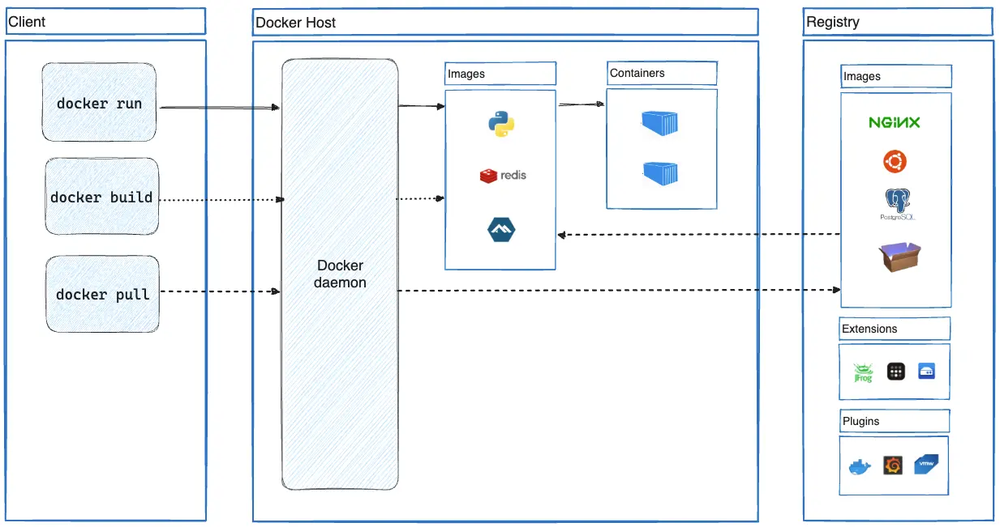

# Lecture Plan

1. Docker

- Docker is a open source platform for developing, shipping and running applications. 
- Docker allows to package and run an application  in a loosely isolated environment called a container.

**Docker Architecture**

**Docker Client**: Docker client communicates with docker daemon using docker API.

**Docker daemon** : listens for docker api requests. manages docker objects (images, containers, volumes and netwrorks).

**Docker image**: Template with instructions to create docker conatiner. contains everything thats necessary to run an application( socurce code + config files). Also contains a execution command that is executed when the image in run in a container.

**Docker Container**: An isolated enviorment to run docker images.

**Docker Registry**: A store for docker images. 

- private registry
- public registry: docker hub.

**Docker Commands**

1. `docker ps`: list running containers
2. `docker ps -a` list all containers
3. `docker image ls` : list all images in private registry
4. `docker run [-d](detached mode) -p ` : to run the image in a container. (`docker create image-name` + `docker start container-id`)
5. `docker build path/to/project -t name:version` : to build a docker image
6. `docker pull`: to pull the image from the docker hub.
7. `docker push`: to push the image to  the docker hub.
- create a repository in docker hub
- tag the image `dokcerhubid/name:version`
- `docker push image-name`
8. `docker start container-id`: to start a container
9. `docker stop container-id`: to stop a conatiner. it waits for program to stop running.
10.  `docker kill container-id`: to stop a container
11.  `docker rm container-id` : to delete a container
12.  `docker image rm image-id` : to delete an image
13.  `docker system prune` : all the stopped containers and unused images, networks and volumes are deleted.
14.  `docker exce container -it id command [sh](shell)` : to execute a commands inside of the container.
15.  `docker logs  container-id` : show log files of a container
16.  `docker logs  --since time container-id` : show log files of a container for a specific period of time
17.  `docker logs  --tail n container-id` : show log files of a container with count n.
18.  `docker init` : helpfull to build an image with guided procedure.

-it : -i +-t

`-i` : keeps SDIN open
`-t` : makes sure that the text is entered and output text is formated properly.

VM Isntance

1. `sudo yum install -y docker`
2. `sudo service docker start`
3. `sudo service docker stop`
4. `sudo service docker status`