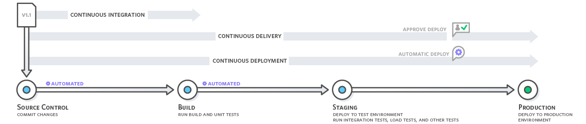

1. Jenkins
2. Static code analysis

### CI/CD 

**Continious Integration:** Integration of new code to an existng code repository.

**Continious Delivery:** CI triggers a build process. The code chnages are automatically built, tested and prepared for a production release.

**Continious Deployment:** The artifact is automatically deployed to production environment.

### Jenkins

- Jenkins is an open source, self contained, automation server for CI/CD>

**Plugins**

- to improve the functionalities of jenkins plugins are used. there are thousands of plugins which can be installed like githib, aws.
- Plugin manager is used to install plugins.

**Jenkins Credentials Manager**

- jenkins has multiple 3rd party integrations that come with credentials. Jenkins credential manager is used  to store and manage credentials in a secured way.

ex: Secret text, credentials, secet file, and SSH keys etc.

**Projects or Jobs**

- project/job is used to perform a unit of work. ex: a pipeline

**Jenkinsfile**: Jenkinsfile is a text file that contains the definition or template of a pipeline.

- **agent**: specifies where the entire pipeline or build will run in jenkins enviorment. 

[agents](https://www.jenkins.io/doc/book/pipeline/syntax/#agent)

- **stage**: a subset of work. ex: build, test, deploy. stages  have  steps(step is a single task).

Jenkins Installation : [jenkins on aws](https://www.jenkins.io/doc/tutorials/tutorial-for-installing-jenkins-on-AWS/)

**Plugins**

- git
- docker pipeline
- docker plugin

**Credentials**

- docker hub

**webhook**

github --> settings --> webhook --> set `jenkinserver-uri//github-webhook/`

### Static Code analysis

