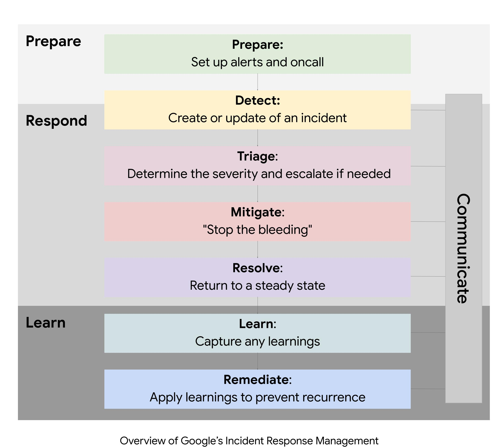

# Incident Management

### Overview

- Incident management is migrating the impact due to failure and restore the service to its previous state.

### Trigger conditions

1. user reports a problem
2. Automated alerts from event managent tools
3. technical staff identifing the probelm

## Mitigation and Resolution

### Leadership or Incident command system

Three roles are

1. Incident commander
2. Communications lead
3. operations lead

- IC leads the incident response. CL and OL report to IC.

**references:**

1. [pager duty](https://response.pagerduty.com/about/)
2. [IMAG](https://sre.google/sre-book/managing-incidents/)

#### Incident commander

- The person who declares the incident becomes the Incident commander. they define the response task force, assiging the responsibilities. They hold all the positioms that are not deletgated.

#### 3 C's of incident management

1. Coordinate incident response effort.
2. Communicate between inciden responders, within the organization and the outside world.
3. Maintain control over the incident response

#### Communication Lead

- public face of the incident response team. communicate with the stakeholders, incident response team, and managing the enquiries. they might also maintain an accurate and up to date incident document.

#### Ops lead

- Ops lead tries to resolve the incident using operational tools. Ops teasm should be the only group modifing the system during the incident.

#### planning role

- supports ops team. filing bugs, arranging handoffs, and tracking applications to identify the anaomilities.

### Live Incident State docuemnt

- IC maintans a livivng incident document. This docuemnt should be editable my many people.

[Live incident management document sample](https://sre.google/sre-book/incident-document/)

## Postmortem

<i>The cost of failure is education</i>

#### Introduction

- postmortem is a docuemented record of an incident, its impact, the mitigation process and the root causes of the incident.
- postmortem is used to prevent incident from recurring.

**postmortem triggers**

- user visible downtime or not meeting the SLO.
- Data loss
- On call engineer intervention for rolback, traffic rerouting.
- resolution time exceeds the SLO.
- A monitoring failure

#### Blameless culture

- for a postmortem to be blamesless, it should be focused on the root causes not the people.
- everyone involved has good intentions and did their best with the information that they have.

### Postmortem sections

**Summary data:** Effective summary of the incident and the resolution process

**timeline**

- timeline of the incident includes key events and the response process.

**Action Items**

- list of measures taken during the incident managemnet that are helpfull to tackle the similar incident in future.

**Lessons learned**

- what went well?, what went bad? and where we got lucky?

[postmortem reports](https://sre.google/workbook/postmortem-culture/)

[postmortem checklist](https://docs.google.com/document/d/1iaEgF0ICSmKKLG3_BT5VnK80gfOenhhmxVnnUcNSQBE/edit)