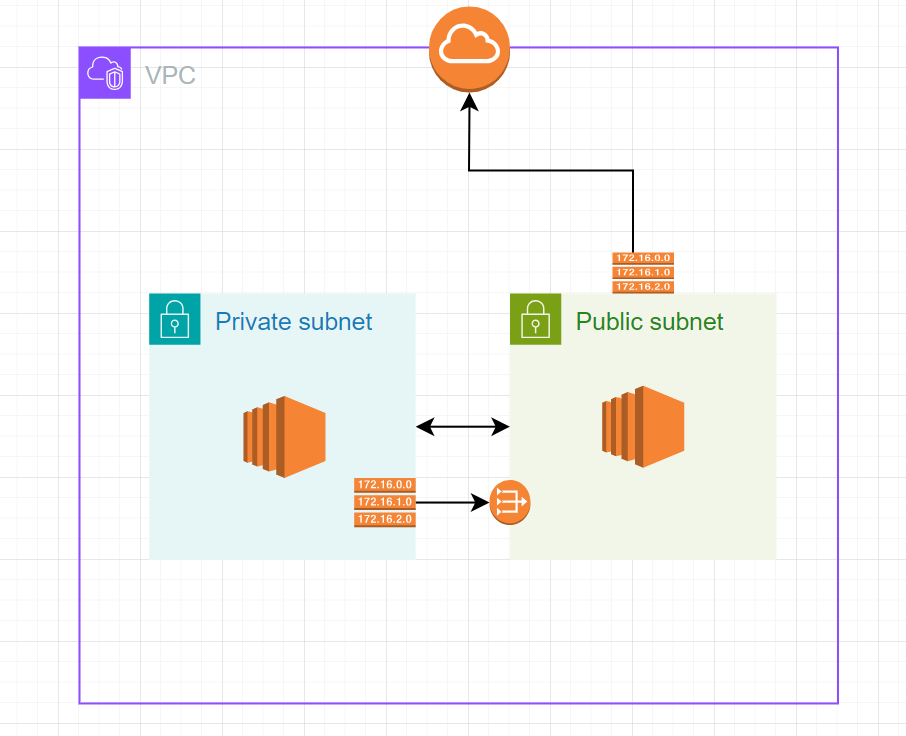

# Lecture Plan

1. Networking
   - VPC
   - Subnets
   - Route Tabels
   - Internet Gateway
   - NAT Gateway

2. Database
   -  RDS
   -  Aurora
   -  ElastiCache


## Networking

### VPC

- Virtual private cloud, which works like a private network that isolates all the resources within it. 

#### Route Table

- A route table contains set of rules, called routes. routes are used to direct the network traffic.

#### Subnet

- subnet is set of network ip addresses that are used to increase the availability and security of your application in AWS.

### Internet Gateway

- Allows VPC to communicate with the internete.

### NAT Gateway

- Network Address Trasalation gatewat allows instcnaces in private subnect to connect to services outside the VPC. The external services cant connect to the instances.

### Security Groups

Netwrork firewall. controls the incomming and outgoing traffic of the instance.




1. Create a VPC with CIDR range
2. Create a public subnet and private subent


**Public Instace**


1. create a route table and associate it with the public subnet
2. Create an internet gateway and attach to the VPC.
3. add a route for all hosts `0.0.0.0/0` to the internet gateway
4. Create an EC2 in public subnet


**Private Instance**

1. create a route table and associate it with the private subnet
2. Create a NAT gateway to the public subent and generate a elastic ip for the NAT gateway.
3. add a route for all hosts `0.0.0.0/0` to the NAT gateway
4. Create an EC2 in private subnet


command to copy the ssh file to the ec2 insatnce


```bash
scp -i public-instance-ssh-key.pem  /path/to/private-ec2/ssh-key ec2-user@public-ip:/path/to/copy
```
 


## Database

### RDS

### Aurora

security

- KMS
- In flight
- Security groups
- IAM roles

### ElastiCache

- redis
- cluster (shards -> node group --> cluster)


**Stratergies**


- Lazy Loading/ Cache aside
- Write-through
- TTL

CIDR

role and snapshot usecase