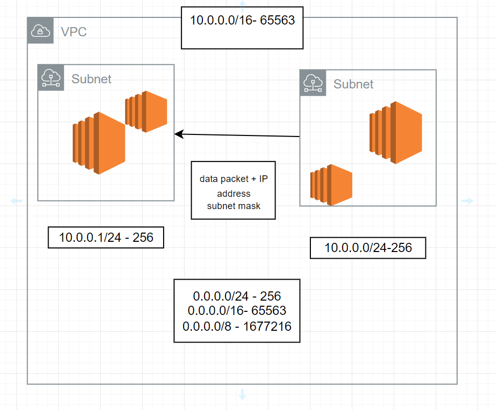

# Lecture Plan

1. Networking
   - VPC
   - Subnets
   - Route Tabels
   - Internet Gateway
   - NAT Gateway

2. Database
   -  RDS
   -  Aurora

---

## Networking

### VPC

- Virtual private cloud, which works like a private network that isolates all the resources within it. 

#### Route Table

- A route table contains set of rules, called routes. routes are used to direct the network traffic.

#### Subnet

- subnet is set of network ip addresses that are used to increase the availability and security of your application in AWS.

### Internet Gateway

- Allows VPC to communicate with the internete.

### NAT Gateway

- Network Address Transalation gatewat allows instcnaces in private subnect to connect to services outside the VPC. The external services cant connect to the instances.

### Security Groups

Netwrork firewall. controls the incomming and outgoing traffic of the instance.


1. Create a VPC with CIDR range
2. Create a public subnet and private subent


**Public Instace**


1. create a route table and associate it with the public subnet
2. Create an internet gateway and attach to the VPC.
3. add a route for all hosts `0.0.0.0/0` to the internet gateway
4. Create an EC2 in public subnet


**Private Instance**

1. create a route table and associate it with the private subnet
2. Create a NAT gateway to the public subent and generate a elastic ip for the NAT gateway.
3. add a route for all hosts `0.0.0.0/0` to the NAT gateway
4. Create an EC2 in private subnet


command to copy the ssh file to the ec2 insatnce


```bash
scp -i public-instance-ssh-key.pem  /path/to/private-ec2/ssh-key ec2-user@public-ip:/path/to/copy
```


**CIDR**

- Classless Inter domain roting
- Network address
- Host address


example:

- each digit represents 8 bits.
ex:

10.0.0.0/8

10 - netwrok address

0.0.0 - host address

ex:

10.0.0.0/16

10.0 - netwrok address

0.0 - host address

[CIDR Reference](https://aws.amazon.com/what-is/cidr/)




#### Creating AWS EC2 using CLI

1. Create key pair

```bash
aws ec2 create-key-pair --key-name key-name --key-type rsa --key-format pem --query "KeyMaterial" --output text > key-name.pem
```

2. Create security-group

```bash

aws ec2 create-security-group --description "desc" --group-name sg-name
```

3. Create instance

```bash
aws ec2 run-instances --image-id ami-id --count 1 --instance-type t2.micro --key-name key-name --security-group-ids sg-id
```

**roles**

- used to provide permissions for aws resources
- IAM --> roles --> create-role --> select resource(ec2) --> select policies.
- Assign the role to the ec2

## Database

### RDS

- Relational Database service.
- Engine Type: MySQL, PostgreSQL, Oracle DB, Microsoft SQL Server, and Maria DB

**RDS Config:**

1. RDS Proxy: Database proxy for connection pooling, query optimization and caching.
2. Autoscaling: Vertical Auto Scaling with threshold value
3. Automated Backups: DB snapshots with retention period
4. Public Access: Yes- accessible ouside the VPC. No- can't be accessed outside the VPC.
5. RDS is associated with security groups. sgs control the inbound and outbound traffic.
6. RDS to EC2 connection can be established. RDS (private subnet) -- EC2 (Public Subnet) and Private RDS can be securedly accssed via ec2.

**DB Instance Class**

- memory optimised
- burtable t series

**Storage**

- gp3
- gp2
- iops
- magnetic

[Intance Types](https://aws.amazon.com/rds/instance-types/)


[RDS Pricing](https://aws.amazon.com/rds/pricing/)


**security**

- KMS for at rest security
- In flight encryption
- Security groups
- IAM roles

### Aurora

- commercial MySQL and PostgreSQL databases
- multi AZ upto 3 AZ with availability of 99.99%
- Aurora Serverless (ASU's)


**Aurora DB Cluster**

- contains one or more DB Instances

1. Primary DB instance: support read+write (every cluster has 1 primary db)
2. Replica - supports read. max 15 replicas.


[Aurora Pricing (serverless, database, replica and backups)](https://aws.amazon.com/rds/aurora/pricing/)


**Activities:**

1. Creating a VPC, public and private subnet, an internet gateway for vpc, and Nat gateway. Create two EC2 instances one in public SN and other in private SN. SSH into the EC2 instances.
2. Create an RDS with public access enabeled. 
3. Create a private RDS and access it via EC2. 