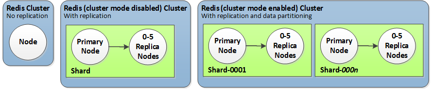
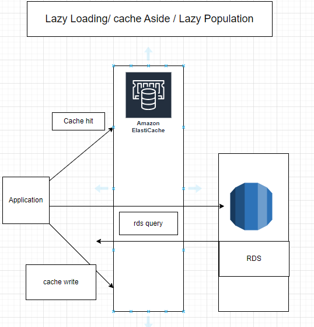
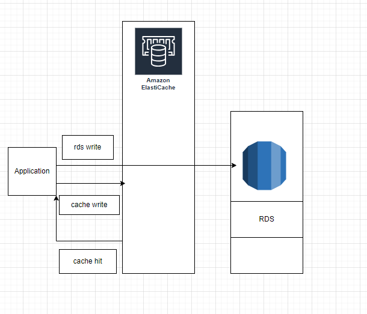

# Lecture Plan

1. ElastiCache
2. S3

---

### ElastiCache

- memcached and redis
- cluster (shards (Primary + replica nodes))
- serverless




**Stratergies**

- caching necessity, data for caching.

**Design Pattern**
- Lazy Loading/ Cache aside/ Lazy Polulation
- Write-through
- TTL



**Write through**




requirements

ec2:


```bash

sudo yum install -y python3-pip

pip install sqlalchemy python-dotenv redis pymysql
```


[ElastiCache pricing](https://aws.amazon.com/elasticache/pricing/)


### S3 (Simple Storage Service)

- Amazon S3 is one of the main building blocks of AWS
- Its advertised as "Infinite scalling" storage
- Many websites use S3 as backbone and many services use s3 as an intergration.


**Use Cases**

- Backup and storage
- Disaster recovery
- Archive
- Hybrid Cloud storage
- Application hosting
- Media hosting
- Data lakes & big data analytics
- Software delivery
- Static website


Buckets (Directories, unique name(across all regions and all accounts))
  - objects(files)

- Buckets are defined at the region level (S3 looks like a global service but the buckets are region specific )
- Naming Convention
   - No uppercase, no underscore
   - 3-63 char long
   - lowercase letters, numbers, dots (.), and hyphens (-) are allowed.
   - Not an IP
   - Must start with lowecase letter or nummber
   - must not start with prefix xn--
   - must not end with suffic -s3alias

Objects:

- objects have a key
- key is the full path 
    ex: s3://my-bucket/*my_file.txt*
        s3://my-bucket/*my_folder/my_file.txt*
    - Key = prefix + object name
- There is no concepts of directories within buckets. Just keys with very long names.
- Objects values are content of the body
- Max Object size is 5TB (5000GB)
- if uploading more than 5GB multi-part upload is must
- Metadata (list of key/value pairs - system or user metadata)
- Tags (Unicode key/value pair) - usefull for security /lifecycle
- Version ID (if versioning is enabled) 


#### S3 Security

- User based: IAM policies- which API calls should be allowed for a specific user from IAM
- Resource Based: 
    -  Bucket Policies: bucket wide rules from S3 console - allows cross account
    -  Object Access Control List (ACL) - finer grain (can be disabled)
    -  Bucket Access Control List (ACL) - less common (can be disabled)  

- If IAM policies are allowed or resource policy is allowed and if there is no expilict deny an IAM Principle can access the bucket
- Encryption :encrypt objects in AWS S3 using encryption keys


**[S3 staorage classes](https://aws.amazon.com/s3/storage-classes/)**


#### S3 bukcet policies:

- Json based policies:
    - Resource: buckets and objects
    - Effect : allow or deny
    - Actions : get, put, and delete etc.
    - Principal: Aws account user, role and root user
- S3 bucket policy can be used to:
    - grant public access to the bucket
    - force objects to be encrypted at upload
    - grant cross access to another account 

- Bucket setting to block public access take priity over the bucket policies
- Used to avoid data leaks
- Can be set at te account level

#### Static Web Hosting

- S3 can host static websites and have them accessible on the internet
- The website url will be based on the url (http://bucket-name.s3-website.aws-region.amazomaws.com or  http://bucket-name.s3-website-aws-region.amazomawsl.com)

- enable the static webhosting in properties and add the index.html file


Steps:

1. upload the files
2. properties --> enable static web hosting --> index.html
3. access the url

#### Versioning

- you can version your files in AWS S3
- It is enabled in bucket level
- same key overwrite will chnage the version: 1,2,3,4...
- The files can be protected against the unintended dletes and easy to roll back to previous version.

Note: Any file that is not versioned prior to enabling will have version null


Creating bucket

1. S3 --> create --> bucket name and other info. (disable block public access, optional (versioning))
2. bucket --> upload objects --> select the object --> upload
3. accessing the obj with obj url is denied as the bucket policy is not configured.
4. object --> open will allow you to access the object.

Creating the buckt policy

1. bucket --> permissions --> bucket policy --> policy generator --> generate policy for s3


**Sample policy to get all objects in a bucket**

```json
{
    "Version": "2012-10-17",
    "Id": "Policy1714716562223",
    "Statement": [
        {
            "Sid": "Stmt1714716560539",
            "Effect": "Allow",
            "Principal": "*",
            "Action": "s3:GetObject",
            "Resource": "arn:aws:s3:::bucket-name/*"
        }
    ]
}

```


<i><b>Note:</b>Block public access takes precedence over the bucket policy.
</i>

**Activities:**

1. Implement the Lazy loading and Write through caching stratergies using the ElastiCache and RDS.
2. Create S3 bucket and deploy a frontend application by enabling static web hosting and create custom bucket policies.

