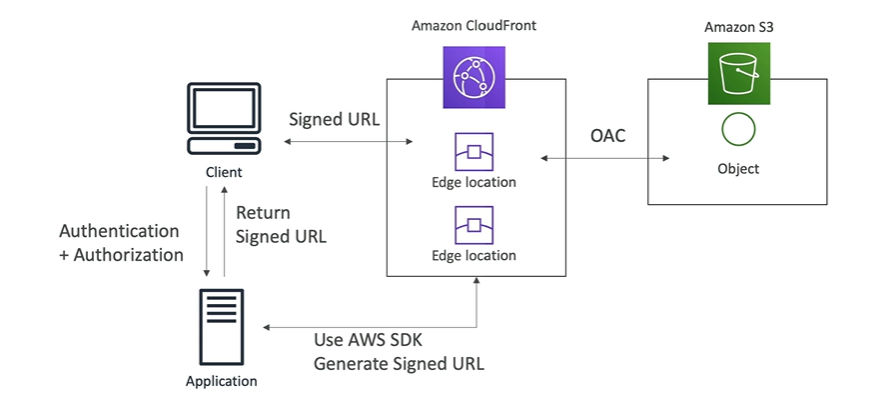

# Lecture Plan

1. ElastiCache
2. S3
3. CloudFront

---

### ElastiCache

- memcached and redis
- cluster (shards (Primary + replica nodes))
- serverless


**Stratergies**

- caching necessity, data for caching.

**Design Pattern**
- Lazy Loading/ Cache aside/ Lazy Polulation
- Write-through
- TTL

requirements

```bash
pip install sqlalchemy python-dotenv redis
```


[ElastiCache pricing](https://aws.amazon.com/elasticache/pricing/)


### S3

- Simple Storage Service


**Storage Classes**


**Bucket Policies**


**Static Web Hosting**


**CORS**


### Cloud Front

- Content Delivey Network. Improves the read performance, content is cached at the edge locations(600+).

**Cloud Front Origin**

1. S3 Bucket

   - for distributing files and caching then at edge
   - Origin Access contriol
   - ingress to upload files to S3

2. Custom Origin (HTTP)

   - Application Load balancer
   - EC2 Instance
   - S3 website 

s3 website (S3 bucket with blocked public access)using cloud front

- disble the web security

#### Caching and Caching Policies


- the cache is  stored at CloudFront edge location.
- cache key is used to identify the cache object. 
- by default cache key = hostname+ resource portion of the url.
- 
**ex:** 
host name: revhire.com

GET request portion: /index.html

- the goal is to maximize the cache hit and reduce the requests to origin
- CacheInvalidation API is used to invalidate the part of the cache.


**Cache Policies**

- Cache Based on:

  - HTTP Headers
  - Cookies
  - Query Strings
- Control the TTL (0 sec to 1 year) by  the origin using Cache control header and expires header   
- custom and predefined policies can be use.

**Origin Request Policies**

- values to be included in origin request without including them in the cache key.
- values can be HTTP headers, cookies and query strings


ex:

cache policy

- hostname
- path
- header: authorization

origin policy:

- headers: User-Agent
- Cookies: session_id
- Query Strings: ref

#### Caching Invalidations & Behavior

**Invalidate**

- The cache will be refreshed when after the TTL has expired.
- A partial or full cache refresh can be performed using CloudFront Invalidation

**Behavior**

- configure settings like routing to different orgins based on the content type and path pattern


ex: /images/* , /api/*, /* (default cache behavior)

- custon cacge behaviors take precedence over the default cache behavior.

use case:  

1. access to S3 after signin by using signin cookies.
2. static content - no cache rules. dynamic content requires cache rules based on headers and cookie.


#### Geo Restriction


- Allow and block lists can be set up specific to countries.
- Based on user ip the Geo location of user is identified.
- Dist --> Security --> Geo Restrictions


#### Signed Url/Cookies

- Used to share content to specific users for a specific period of time.
- Signed URL includes:
   - URL Expiration
   - IP ranges to access the data from
   - Trusted signers (AWS accounts that can create signed URLs)
- Validity:
  - Shared content: short - few minutes  
  - Private content : long - last for years
- Signed URL : one per file
- Signed Cookies: one for multiple files.





**Process:**

- trusted key group (recommended)
- aws account that contains cloud front key pair (root account + console for key management)

trusted key groups

- one or more trusted key groups
- public/private key. pub - cloud front. private key - application.


#### Real Time Logs


- store real-time requests recived by cloud front to kenisis data streams
- monitoring and analyzing
- sample rate (% of requests , specific fields and chache behavior)