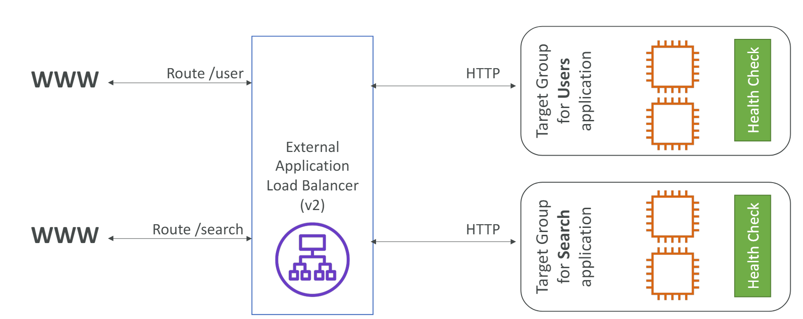
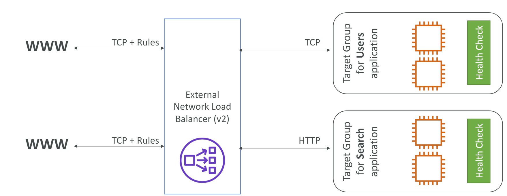

# Lecture Plan

1. CloudFront
2. Load Balancing


### Cloud Front

- Content Delivey Network. Improves the read performance, content is cached at the edge locations(600+).

**Cloud Front Origin**

1. S3 Bucket

   - for distributing files and caching then at edge
   - Origin Access contriol
   - ingress to upload files to S3

2. Custom Origin (HTTP)

   - Application Load balancer
   - EC2 Instance
   - S3 website 

s3 website (S3 bucket with blocked public access)using cloud front

- disable the web security

#### Caching and Caching Policies


- the cache is  stored at CloudFront edge location.
- cache key is used to identify the cache object. 
- by default cache key = hostname+ resource portion of the url.
- 
**ex:** 
host name: revhire.com

GET request portion: /index.html

- the goal is to maximize the cache hit and reduce the requests to origin
- CacheInvalidation API is used to invalidate the part of the cache.

**Cache Policies**

- Cache Based on:

  - HTTP Headers
  - Cookies
  - Query Strings
- Control the TTL (0 sec to 1 year) by  the origin using Cache control header and expires header   
- custom and predefined policies can be use.

**Origin Request Policies**

- values to be included in origin request without including them in the cache key.
- values can be HTTP headers, cookies and query strings


ex:

cache policy

- hostname
- path
- header: authorization

origin policy:

- headers: User-Agent
- Cookies: session_id
- Query Strings: ref


<b><i>Note</b>

1. cache policies are created to manage how the content is cached.
2. Origin policies are created to control which data is sent to the origin when a cache miss occurs.

</i>

#### Caching Invalidations & Behavior

**Invalidate**

- The cache will be refreshed when after the TTL has expired.
- by default the TTL is 1 day.
- A partial or full cache refresh can be performed using CloudFront Invalidation

Distribution --> Invalidations --> create --> add path for files.

**Behavior**

- configure settings like routing to different orgins based on the content type and path pattern


ex: /images/* , /api/*, /* (default cache behavior)

- custon cacge behaviors take precedence over the default cache behavior.


Dist --> Behavior --> create --> add paths 


use case:  

1. access to S3 after signin by using signin cookies.
2. static content - no cache rules. dynamic content requires cache rules based on headers and cookie.


#### Geo Restriction


- Allow and block lists can be set up specific to countries.
- Based on user ip the Geo location of user is identified.
- Dist --> Security --> Geo Restrictions --> Allow and Block Lists


#### Signed Url/Cookies

- Used to share content to specific users for a specific period of time.
- Signed URL includes:
   - URL Expiration
   - IP ranges to access the data from
   - Trusted signers (AWS accounts that can create signed URLs)
- Validity:
  - Shared content: short - few minutes  
  - Private content : long - last for years
- Signed URL : one per file
- Signed Cookies: one for multiple files.


Cloud Front --> Left Navigation bar --> Public Key --> Key Group and select the public key

Login as root user --> Security Credentials --> Create Cloud Front key Group (Public Key and Private key are autogenerated and you can download them)


**Process:**

- trusted key group (recommended)
- aws account that contains cloud front key pair (root account + console for key management)

trusted key groups

- one or more trusted key groups
- public/private key. pub - cloud front. private key - application.


#### Real Time Logs


- store real-time requests recived by cloud front to kenisis data streams
- monitoring and analyzing
- sample rate (% of requests , specific fields and chache behavior)


### Load Balancer

**Scalability:**

- The increase in compute, storage, networking based on the traffic to applications.

**Availability:**

- 

**Load Balancing:**


#### ELB

- Elastic Load Balancer is managed by AWS.
    - AWS manages the availability
    - AWS manages the upgrades and maintainance
    - Few config knobs are available
- Can be integrated with many AWS Services like EC2, ASG and Route 53 etc.
- Load Balancer uses  heath checks to check the health of the applications deployed in ec2s.


**Types**

1. Classic Load Balancer (v1 old gen) - 2009
    - HTTP/HTTPS,TCP,SSL 
    - Deprecated
  
2. Application Load Balancer(v2 new gen) - 2016
    - HTTP, HTTPs, Websocket
3. Network Load Balancer (v2 new gen) - 2017
    - TCP, SSL, TLS, UDP
4. Gateway Load Balancer - 2020
    - IP Protocol


#### Application Load balancer

- Layer 7 (HTTP)
- Route to different taget groups
- routing based on hostname, path, and query string etc.
- best for MSA, Container based applications, private ips and lambda functions.
- port mapping to redirect to dynamic port in ECS.
- The client ip is hidden using connection termination.
- true ip is hidden in header X-Forwarded-For, port as X-Forwarded-Port an protocol as X-Forwarded-Proto


**user data**


```bash
#!/bin/bash
# Use this for your user data (script from top to bottom)
# install httpd (Linux 2 version)
yum update -y
yum install -y httpd
systemctl start httpd
systemctl enable httpd
echo "<h1>Hello World from $(hostname -f)</h1>" > /var/www/html/index.html
```




#### Network Load Balancer

- Layer 4
- Forward UDP and TCP traffic to insatnces
- andle millions of requests with low latency (100ms). for ALB its 400 ms
- static ip per AZ and supports elastic ip
- used for high performce TCP and UDP traffic.
- Not included in free tier



#### Gateway Load Balancer

- Operates in layer 3 (Network Layer). Listens to IP packets across all ports and forwards the traffic to the target group.
- It combines transparent network gateway(single entry point and exit point for all traffic) and distributes traffic based on demand.
- The Gateway Load Balancer and its registered virtual appliance instances exchange application traffic using the GENEVE (Generic Network Virtualization Encapsulation) protocol on port 6081.
- Suitable for hybrid cloud archictecture. (AWS and on premis resources) and for routing traffic across different aws regions and on premis environments.

[Loadbalancer pricing](https://aws.amazon.com/elasticloadbalancing/pricing/)

#### Sticky sessions


#### Cross Zone load balancing


#### SSL/TLS & SNI


- Secure Socket layer allows traffic between your clients and your application to be encryotedin transit(in flight).
- Transport Layer Security, newer version.
- TLS Certificates are mainly used, but are still refered as SSL.
- Public SSL Certificates are issues by Certificate Authorities (CA)
- ACM (AWS Certificate Manager is used to manage the SSL Certificates)
- SNI (Server Name Indication) to specify the hostnames for multiple SSL Certificates.
- Client should Specify the hostname during the initial SSL handshake. 


#### Activities

**CloudFront**

1. Create a CloudFront OAC dist for S3
2. Create Invalidations
3. Configure the Geo restrictions

**Elastic Load Balancer**

1. Create ALB for an Ec2 target group
2. Configure the SG to route the traffic to ec2 rivately using the ALB
3. Create Sticky Sessions

**Other**

1. Deploy a spring-boot application in EC2 and create an ALB and deploy frontend in S3 and create a distribution in Cloud Front.