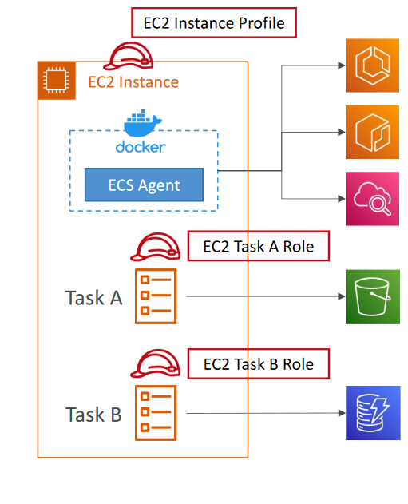

# Lecture Plan

1. ECS


### AWS ECS 


Elastic Container Service. used to launch docker containers. ECS tasks are launched on ECS clusters.

**Capacity**: the infrastructure where your containers run

**Controller**: used to deploy and manage your applications that run on the containers

**Provisioning**: the tools that you can use to interface with the scheduler to deploy and manage your applications and containers


#### EC2 Launch type

- ec2 instances are used to deploy the docker containers.
- provisioning and maintaining the resources is your responsibility
- ECS agent is run in every instance in the cluster.


#### Fargate

- no instances to manage.
- serverless
- ECS tasks are used to create cluster based on CPU/RAM requirements
- scalling - increase no of tasks.


- both can be integrated with a ELB.

#### IAM roles

**EC2 instance profile**

- ECS Agent
- Making calls to ECS Service
- Cloud Watch logging
- Pull image for ECR
- access secrets from Secrets Manager or SSM Parameter store

**ECS Task role**

- each task has a specific role. different roles are uded to access different ECS services.





#### Data Volumes

- EFS file system
- compatable with EC2 and fargate
- multi AZ shared storage

#### ECR

- Elastic Container Registry is used to store docker images
- public and private repository
- can be integrated with ECS, stored in S3.
- image vulerability, scanning and tagging.


1. create a repository in AWS ECR
2. Execute the push commands in poweshell or linux terminal
3. Optional steps if login is denied

```
Set-ExecutionPolicy RemoteSigned
Install-Module -Name AWS.Tools.ECR
Initialize-AWSDefaults -Region us-east-1
```


<i><b>Note:</b>
aws cli should be configured before pushing the image to ecr
</i>


#### Cluster

group of container instances. Tasks can be placed on the containers.


#### Task

blueprint for your application, defined in a task definition file. It specifies the Docker containers that make up your application, including details like the Docker image to use, resource allocation, networking, and data storage volumes. 


#### Service

configuration that allows you to run and maintain a specified number of task definition instances simultaneously in an ECS cluster. It ensures that the desired number of tasks are running and restarts any tasks that fail. A service is a long-running process that maintains the specified task count.


#### Task definition & placement

- binpack
- random
- spread : instanceid, availability zone.
- combined


**constraints:**

- distinctinstance: place each task on a different container instance
- memberOf: expression in Cluster Query language.

ex: instance type


#### Auto Scalling


- AWS application autoscaling at task level

    - CPU utilization
    - Memory
    - ALB target request count

- Target tracking: scale based on target value specific to CloudWatch metrics
- Step Scaling: scale based on a specific cloud watch alarm
- Scheduled scaling: scale based on scheduled time/date
- scalling option: ASG scaling and ecs scaling provider. (EC2 launch type)

#### ECS Rolling updates


- Blue Green and Rolling

**Rolling**

- min and max percentages for no of tasks.


**Steps:**


1. Create Cluster

- EC2 Launch type
- t2 micro
- ASG: min: 1 max:1


2. Task Creation

- container: image name, port and imagename-port-tcp

3. Service Creation

- select launch type : ec2
- select task
- load balancing: ALB
- enable the logs


**pricing**

[ECS](https://aws.amazon.com/ecs/pricing/)
[ECR](https://aws.amazon.com/ecr/pricing/)


