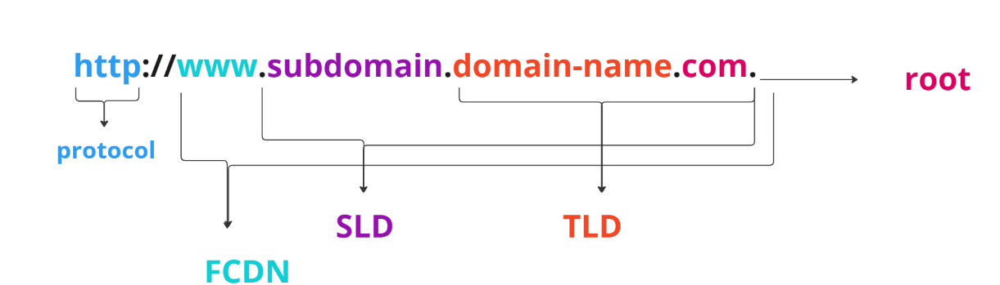

# Lecture Plan

1. Route53

### Route 53

#### DNS

**Domain Registrar:** Amamzon Route 53, GoDaddy

**DNS Records:** A, AAAA, CNAME, NS

**Zone file:** Contains DNS records

**Name Server:** resolves DNS Queries

**Top Level Domain:** .com, .in, .org

**Second Level Domain:** amazon.com, google.com

- AWS Route 53 is highly available, scalable, fully managed and Authoritatvie(Customer can update the DNS records) DNS.
- Domain Registrar
- Health check for resources
- 100% availability SLA

**Route 53 records**

- record is used to define how the traffic is routed for a domain
- each record conatins a domain/subdomain, record type, value, routing policy and TTL(cache time at DNS resolvers).
- Route 53 supports the following DNS record types:
    - A/AAAA/CNAME/NS
    - Advanced CAA/DS/MX etc

**Record types**

- A: maps hostname to IPv4
- AAAA: maps hostname to IPv6
- CNAME: maps hostname to another hostname. target domain must be A or AAAA record.
- NS: Name servers for the hosted zone

**Hosted Zones**

- A container for records that define how to route traffic to a domain and its subdomains
**public hosted zones:** records for routing traffic from internet
**private hosted zones:** records for internal routing in the VPC.

#### Registering a domain

- a domain name thats available can be registered.
- Domain can also be transfered into Route53

#### Creating records

- record name. ex: test.revature.com
- type: A/AAAA/CNAME
- value (ip address)
- TTL in sec

#### TTL

- DNS name is retreived during the first request from client to AWS Route 53
- the client caches the record for a certain duration.
- as the record names do not change often caching is a good option. 
- caching reducs the traffic to Route53.
- TTL is mandatory for all records except for the Alias records

#### CNAME (canonical name) vs Alias

- Map hostname to a domain

- CNAME : points to other non root host names.
- Alias: points to any aws resource hostname
- free
- type A/AAAAA
- cant set TTL
- inbuilt target health tracking

**targets**

- ELB
- CloudFront dist
- API Gateway
- Elastic Beanstalk
- S3
- VPC inference endpoints
- Route 53 in same hosted zone

Note: EC2 DNS is not supported.

#### Routing Policies

- polciy to configure how Route53 responds to the DNS queries
**types**

- Simple:

    - single resource
    - multiple values in same record. a random one is choosen by the client.
    - cant be associated with health checks

- Multi-Value:

    - used to route traffic to multiple resources from multiple values
    - returns 8 healthy records per user query

- Weighted: 

    - control response to % of the requests
    - DNS record of same name and type
    - can be associated with health checks
    - ex: LoadBalancing, testing application(Blue Green deployment traffic routing)
    - assign 0 to not to send any traffic.
- Latency based:
    - based on the users location the resource from the nearest region is returned.
    - supports health checks.
- Failover: diverts the traffic to a healthy instance.
- Geolocation: 
  - routing based on user location. spcify the location, country and the state. 
  - a default config for no match.
- Geoproximity:
  - routing based on user location and the resource location based on a bias value(-99 to 99).
  - AWS and non AWS resources.
  - Route53 traffic flow(Visual editor with a policy) is used.
- IP policy: routing based on the CIDR ranges

#### 3rd party Domain

- A domain registered in a 3rd party registrar can be managed using AWS Route53.
- Configure the rules Route53 rules in the registrar. 

#### Health Checks

- HTTP health checks are used to check the health of public resources
- Health Check: Automated DNS Failover

    1. endpoint: aws resource
    2. calculated: health check that monitors the health check. combine the metrics from all HCs.
    3. cloud watch alarm for a cloud watch metric: for privated hosted zones.

- resource is considered healthy when atleast 18% of health checkers report it as healthy.

